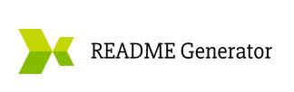

  <!-- PROJECT TITE -->
  <h1 align="center">Profesional README generator</h1>
  
  <!-- DESCRIPTION -->
  

  Generates a profesional looking README based on user Input
  

  <!-- TABLE OF CONTENTS -->
  

  
Table of Contents

  <ol>
  <li><a href="#about-the-project">About The Project</a></li>
  <li><a href="#built-with">Built With</a></li>
  <li>
    <a href="#getting-started">Getting Started</a>
    <ul>
    <li><a href="#prerequisites">Prerequisites</a></li>
    <li><a href="#installation">Installation</a></li>
    </ul>
    </li>
  <li><a href="#contributing">Contributing</a></li>
  <li><a href="#license">License</a></li>
  <li><a href="#contact">Contact</a></li>
  <li><a href="#acknowledgements">Acknowledgements</a></li>
  </ol>
  

  
  
  <!-- ABOUT THE PROJECT -->
  ## About The Project

  
  9th Challenge for the University Of Toronto Coding Bootcamp
  
  
  ### Built With

  JavaScript,HTML,ES6,Node
  
  <!-- GETTING STARTED -->
  ## Getting Started
  
  ### Prerequisites

  node, terminal

  ### Installation 

  navigate to the folder where index.js is located and run node index
  
  <!-- CONTRIBUTING -->
  ## Contributing
  
    Name: nadir
    GitHub: nadirhadad
    
    Name: fer
    GitHub: fernandasariñana
    
  <!-- LICENSE -->
  ## License

  Academic Free License v3.0
  
  <!-- CONTACT -->
  ## Contact
  
  Said Hadad - saiddavid.hadad@gmail.com
  
  Project Link: [https://github.com/SaidHadad/Challenge-6-Server-Side-APIs](https://github.com/SaidHadad/Challenge-6-Server-Side-APIs)
  
  Live Page: [https://saidhadad.github.io/Challenge-6-Server-Side-APIs/](https://saidhadad.github.io/Challenge-6-Server-Side-APIs/)
  
  